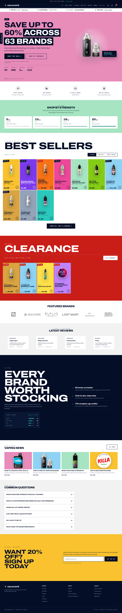

# Aquavape — rebrand prototype

A working front-end prototype of the rebranded Aquavape storefront. Live at
**https://yameenbux.github.io/aquavape-rebrand/**, or serve it locally:

```bash
python3 -m http.server 8899
# then open http://127.0.0.1:8899
```

No build step, no dependencies, no network calls. Fonts are self-hosted.



## Why it is built this way

The live theme is Liquid + **native Web Components** + Glide.js, with no
framework. This prototype matches that architecture deliberately — plain
HTML, token-driven CSS, and vanilla ES modules — so every component here
ports to a Liquid section without a rewrite. Adding React would have made
the port harder, not easier.

## A finding that changed the design

While pulling product photography from `products.json` I counted the actual
catalogue. It does not match the story the live homepage tells:

| | |
|---|---|
| Products | 998 |
| Brands | 63 |
| E-liquid lines | 205 |
| Deepest ranges | Hayati 161, Lost Mary 106, IVG 74, SKE Crystal 60 |
| Aquavape own-brand | not in the catalogue |

The live homepage headline reads "PREMIUM UK MADE ELIQUID" and its best
sellers row shows four own-brand 10ml liquids — Fresh Menthol, Wild Berry,
Raspberry Menthol, British Tobacco, all "by Aquavape". **None of those four
products are in the live catalogue**, and no own-brand e-liquid line appears
anywhere in it.

So Aquavape, as it trades today, is a **multi-brand stockist**, not a
manufacturer. Its value to a customer is range, availability and price
across 63 brands.

The first version of this prototype was built on the opposite premise —
"mixed and bottled in Lancashire", batch codes, "know what's in the bottle".
That was a provenance story for a business that does not appear to exist in
the data. It has been replaced by a range story, and the gauges in that
section now encode real line counts per brand.

**This is worth checking on your side.** Either the own-brand line was
discontinued and the homepage was never updated, or it is listed somewhere
the products endpoint does not reach. If it was discontinued, the live
homepage is currently advertising four products that cannot be bought, and
"UK MADE" is doing work the catalogue cannot support.

## The design direction

### What was wrong with the first version

It was a template painted eight colours. The audit made it plain: ten
sections, every one with 84px padding and a 46px heading and the same
eyebrow-then-grid recipe. Scrolling it was the same slide over and over with
the background swapped. Nothing ever broke its box — no overlap, no bleed,
no scale jump. Every colour band sat between two neutral bands, so the
palette was *applied* rather than composed. And the one asset the catalogue
actually owns — flavour — was used as a 16% tint.

Correct, accessible, systematic. Not designed.

### The subject, named

Not a pharmacy: a **pick'n'mix counter for adults**. 998 products, 63
brands, and every one is a flavour with a colour — Blue Raspberry, Rhubarb
& Custard, Pistachio Gelato, Bubblegum. Shoppers arrive knowing a flavour,
a strength and a budget. The page's job is to get them to the right bottle
fast and make the deal feel worth taking now.

### The signature: the flavour wall

The catalogue *is* a colour field, so the product grid stops being
cards-on-a-background and becomes the field itself. Full-bleed to the
viewport edge, 3px gaps, and **each tile entirely its own flavour colour**
with the bottle sitting on it and the type knocked out. A wall of sweets.

Text colour is derived, not chosen: `onFlavour()` in `main.js` computes each
flavour's luminance and picks ink or paper. All 24 catalogue colours were
checked before this shipped, and the rendered tiles were re-measured across
all three tabs — worst pair 5.2:1, every one clears AA. Guessing this by eye
across 24 saturated colours is how you ship an unreadable tile.

The gaps show the band colour rather than a fixed line colour, so the
section becomes the mortar between tiles — and an incomplete last row reads
as the band instead of as a hole.

### Boldness in one place

The wall is loud, so everything around it got **quieter**, not louder:

| | |
|---|---|
| Feature sections (wall, clearance, range, signup) | 112px headings, 84–144px padding |
| Everything else | 32px headings, 52px padding |

That alternation — loud, quiet, loud, quiet — is the rhythm that was
missing. The headings use Archivo's **width axis at 125%**, which is the
reason that typeface was self-hosted and the thing the first pass never
exploited.

### One accessory removed

The category tiles are gone. Four equal rounded tiles was the most templated
thing on the page, and the flavour wall browses better than they did.

## What is carried over from the live site

The promotional machinery is the business, so it stays: the sale hero with
its carousel slots, the 4-for-£10 multibuy flags, the clearance strip, the
20% off standing CTA, the USP promise bar, the trust-icon row, the tabbed
best sellers, the brand logo row and the blog feed.

## What changed, and why

| Change | Reason |
|---|---|
| Hero pairs the offer with a real product | The live hero is a "MEGA SALE" graphic — it sells the discount but says nothing about what Aquavape makes |
| Standing CTA is a tab, not an interstitial | Same acquisition lever, without blocking the page |
| "Shop by strength" promoted to primary navigation | Strength is how this category is actually shopped; the live site buries it in facets |
| H1 now larger than H2 | On the live site H1 renders at 25px and H2 at 31px |
| One review source | The live site runs Okendo, Lipscore and Trustpilot simultaneously |
| One z-index scale | The live theme ships `--z-index-header: 16` and `--zindex-header: 3` |
| One radius value | Theme is square (`--btn-radius: 0`), app widgets are 20–32px round |
| UK provenance given a section | Currently one line of meta description; it is the actual differentiator |
| Age gate designed in | Legally required for UK vape retail, so it should not look bolted on |
| `prefers-reduced-motion` honoured | `theme.css` has no reduced-motion block at all |

## Imagery

All product photography is **real, pulled from `aquavape.co.uk`** on
2026-09-03: 24 shots, re-encoded to WebP with transparency preserved and
cropped to each product's bounding box so every shot fills its frame to the
same margin. 460 KB for the set.

Nothing is stock photography and nothing is drawn. The earlier version used
hand-drawn SVG bottles, which read as placeholder next to the real thing.

Transparency matters here: the cards tint their swatch with the product's
flavour colour and flood it on hover, so a flattened white background would
show as a white box on colour.

The only drawn artwork left is UI iconography — stars, arrows, the USP and
trust icons, and the logo droplet.

## Motion

### The hero carousel

Five slides on a **5-second timer**. Each slide carries its own band colour,
so the palette rotating is the hero rather than a decoration on it: pink
sale, mint multibuy, peach new-in, lilac pouches, yellow clearance. Every
band was contrast-checked on the rendered page before use (lowest 6.08:1).

It runs on its own with **no pause button** — that was a client decision,
and it matches the live site. The trade-off is stated plainly in
`LAUNCH-CHECKLIST.md`: WCAG 2.2.2 asks for a mechanism to pause content that
moves automatically for over five seconds, and a visible control is the
textbook answer. What remains in its place:

- autoplay halts on hover and on keyboard focus anywhere in the hero
- it halts while the browser tab is hidden
- under `prefers-reduced-motion` it **never advances at all**, which covers
  the users the criterion exists to protect

The active dot fills across the interval, so the timer is something the
viewer can see coming rather than something the page does at them. Dots are
`role="tab"` with arrow-key, Home and End navigation, and each button is
40×24px to satisfy WCAG 2.2 Target Size — the visible bar is only 5px tall,
drawn with pseudo-elements inside the larger hit area.

The next slide's image is preloaded on each transition so the swap does not
flash.

### Brand logos

The featured-brands row uses the **real vector logos**, lifted from the live
site's own featured-brands section — ULTD, Aquavape, Elfliq, Lost Mary,
Vapemate and IVG. 20 KB for all six. They were previously set as uppercase
text, which on a phone wrapped "LOST MARY" onto two lines and read as a
placeholder.

Each is a **separate `.svg` file referenced by ``**, not inlined. That
is deliberate: the source markup reuses `id="c"` and `cls-*` class names in
every single logo, so inlining all six would collide and the last one would
repaint the others. Extraction resolved each shape's computed paint to a
literal `fill` and stripped the `<style>`/`<defs>` machinery.

The logos have wildly different proportions — Lost Mary is 8.4:1, ULTD is
nearly square — so a single height makes some enormous and others weedy.
Each sits in a fixed-height box with `object-fit: contain` plus a per-logo
`--logo-scale` multiplier, tuned so all six carry the same optical weight.

They rest at 42% opacity so the row reads as one set rather than six
competing marks, and go to full strength on hover. Logos only — no stock
counts, so the row is a statement of range rather than a table. On any
device without hover, checked with `@media (hover: none)` rather than
guessed from viewport width, they sit at 72% so they read without needing a
hover that will never come.

### Trust icons

The four trust icons **run continuously**. There are two layers, and keeping
them separate is what makes it work:

1. the outlines **draw once**, the first time the icon appears
2. the moving parts then **loop forever**

Re-drawing the outlines every cycle reads as a glitch; looping only the
motion reads as the object doing its job. The card taps like a contactless
payment, the van keeps driving with speed lines sweeping past, the headset's
mic boom swings as if on a call, the parcel bobs. Each icon is offset by
`--idle-delay` so the row does not pulse in unison.

They started out hover-only, which meant they never played on a phone at
all. Continuous is now the behaviour; hover adds nothing.

Two of the icons were also redrawn because they did not read at all: "UK
stock & support" was an arc over a vertical line, which looked like an
umbrella, and the dispatch icon was a peaked box that read as a house with a
crack in it.

Implementation notes: every stroke carries `pathLength="1"` so the draw-on
effects can use a `stroke-dasharray` of 1 regardless of the real path
length, and `transform-box: fill-box` makes transform-origin behave on SVG
children. The replay is a JS class toggle rather than pure CSS, because a
CSS animation does not restart on an element whose classes have not changed.

The hero also runs a **vapour animation** — five blurred radial blobs on
staggered 7-second rises behind the product. It is the only continuously
running animation on the page, and it is switched off entirely under reduced
motion.

The **20% off tab sits on the left edge at every width**, which is where the
live site keeps it. It replaced a fixed bottom banner that was eating 68px
of a phone screen to do the same job.

Otherwise, carried over from the live theme because they are genuine brand
behaviours:
the sliding `::before` button fill, `IntersectionObserver` scroll reveals
(the technique already in `banner-grid.js`), and the two overshoot easing
curves — `--ease-out-back` and `--bounce`. The brand's motion language is
meant to have spring in it.

Everything animated is guarded. Under `prefers-reduced-motion: reduce` the
ticker stops, reveals resolve to their final state, the bottle appears
already filled, and the counter shows its final value. Content still
arrives; it just stops moving.

## Verified

- No horizontal overflow at 390px
- Contrast measured on the rendered page across 26 text elements on all
  seven bands — all pass WCAG AA (lowest 4.74:1)
- Visible focus ring on all interactive elements
- Focus returns to the trigger when a panel closes; `Esc` closes overlays; `/` opens search
- No console errors

## Porting to Liquid

1. `styles/tokens.css` → `assets/theme-tokens.css`, or map into `settings_schema.json`
2. Each `<section>` → a Shopify section with a schema block
3. `scripts/main.js` init functions → `customElements.define()` calls, matching the existing `<usp-bar>` / `<product-item>` pattern
4. `scripts/data.js` → Liquid product loops
5. Swap Archivo/Instrument Sans back to Nexa

See `tools/pull-theme.sh` for getting the real theme source.
