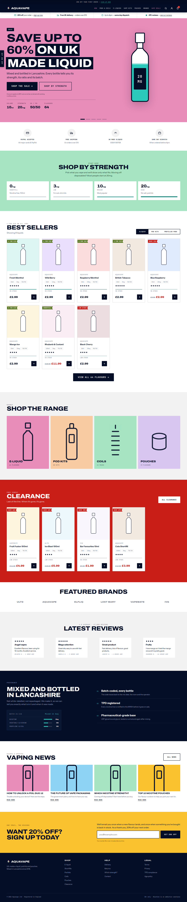

# Aquavape — rebrand prototype

A working front-end prototype of the rebranded Aquavape storefront. Open
`index.html` in a browser, or serve the folder:

```bash
cd prototype && python3 -m http.server 8899
# then open http://127.0.0.1:8899
```

No build step, no dependencies, no network calls. Fonts are self-hosted.



## Why it is built this way

The live theme is Liquid + **native Web Components** + Glide.js, with no
framework. This prototype matches that architecture deliberately — plain
HTML, token-driven CSS, and vanilla ES modules — so every component here
ports to a Liquid section without a rewrite. Adding React would have made
the port harder, not easier.

## The design direction

**Colour-blocked bands, navy anchoring the ends.** Aquavape is a colourful,
promotion-led brand — pink hero, yellow newsletter, red clearance, pastel
category tiles. The redesign keeps that, because a muted version of this
shop would be designing for a different business.

What changes is that the colour becomes a *system*. Five rules:

1. Every section is **one flat band colour**. Never a gradient.
2. Bands alternate saturated / neutral so the page has rhythm.
3. `--fill` (teal) is reserved for liquid levels and nothing else.
4. `--deal` (green) is reserved for multibuy flags and nothing else.
5. `--red` is reserved for clearance and price drops.

Components never read a raw colour. Every band sets `--band-bg`,
`--band-fg` and `--band-mute`, and components resolve through those — so
any component works on any band without a variant.

| Token | Value | Role |
|---|---|---|
| `--ink` | `#040E27` | Brand navy — header, footer, provenance |
| `--pink` | `#E88CBA` | Hero band |
| `--yellow` | `#F9C22E` | Newsletter band |
| `--red` | `#C81E17` | Clearance band, price drops |
| `--mint` | `#A6E4C2` | Shop-by-strength band |
| `--peach` / `--lilac` / `--blush` / `--sky` | — | Category tiles, blog cards |
| `--fill` | `#2BC9BC` | Liquid levels only |
| `--deal` | `#5F7C2C` | Multibuy flags only |

### The signature: the fill gauge

Aquavape sells liquid, by volume and by strength. So every level indicator
on the site is a vessel filling to a real number:

- the **hero bottle** fills to its nicotine strength on load
- **product cards** show stock as a gauge, and flood with the flavour colour on hover
- the **basket** shows progress to free delivery as a filling meter
- the **strength selector** encodes mg as gauge height
- the **batch panel** reports VG/PG composition

It is hard-edged and instrument-like — a laboratory gauge, not a lava lamp.
Each gauge has a 2px meniscus at the surface and nothing else.

### Typography

The live site uses **Nexa** and **Hurme Geometric Sans 1**. Both are
commercially licensed and are not redistributed here, so the prototype
substitutes:

| Role | Prototype | Live site |
|---|---|---|
| Display | Archivo (variable width 100–125) | Nexa |
| Body | Instrument Sans | Nexa |
| Data / specs | JetBrains Mono | — |

Archivo's expanded widths do the work Nexa's wide caps used to do. **Swap
these back to Nexa when porting**, assuming the licence covers it.

The mono face is not decoration: every real measurement on this site —
`10ml`, `20mg`, `50/50`, batch codes, prices — is set in it, because in this
category the numbers *are* the product information.

## What is carried over from the live site

The promotional machinery is the business, so it stays: the sale hero with
its carousel slots, the 4-for-£10 multibuy flags, the clearance strip, the
20% off standing CTA, the USP promise bar, the trust-icon row, the tabbed
best sellers, the brand logo row and the blog feed.

## What changed, and why

| Change | Reason |
|---|---|
| Hero pairs the offer with a real product | The live hero is a "MEGA SALE" graphic — it sells the discount but says nothing about what Aquavape makes |
| Standing CTA is a tab, not an interstitial | Same acquisition lever, without blocking the page |
| "Shop by strength" promoted to primary navigation | Strength is how this category is actually shopped; the live site buries it in facets |
| H1 now larger than H2 | On the live site H1 renders at 25px and H2 at 31px |
| One review source | The live site runs Okendo, Lipscore and Trustpilot simultaneously |
| One z-index scale | The live theme ships `--z-index-header: 16` and `--zindex-header: 3` |
| One radius value | Theme is square (`--btn-radius: 0`), app widgets are 20–32px round |
| UK provenance given a section | Currently one line of meta description; it is the actual differentiator |
| Age gate designed in | Legally required for UK vape retail, so it should not look bolted on |
| `prefers-reduced-motion` honoured | `theme.css` has no reduced-motion block at all |

## Motion

Carried over from the live theme because they are genuine brand behaviours:
the sliding `::before` button fill, `IntersectionObserver` scroll reveals
(the technique already in `banner-grid.js`), and the two overshoot easing
curves — `--ease-out-back` and `--bounce`. The brand's motion language is
meant to have spring in it.

Everything animated is guarded. Under `prefers-reduced-motion: reduce` the
ticker stops, reveals resolve to their final state, the bottle appears
already filled, and the counter shows its final value. Content still
arrives; it just stops moving.

## Verified

- No horizontal overflow at 390px
- Contrast measured on the rendered page across 26 text elements on all
  seven bands — all pass WCAG AA (lowest 4.74:1)
- Visible focus ring on all interactive elements
- Focus returns to the trigger when a panel closes; `Esc` closes overlays; `/` opens search
- No console errors

## Porting to Liquid

1. `styles/tokens.css` → `assets/theme-tokens.css`, or map into `settings_schema.json`
2. Each `<section>` → a Shopify section with a schema block
3. `scripts/main.js` init functions → `customElements.define()` calls, matching the existing `<usp-bar>` / `<product-item>` pattern
4. `scripts/data.js` → Liquid product loops
5. Swap Archivo/Instrument Sans back to Nexa
